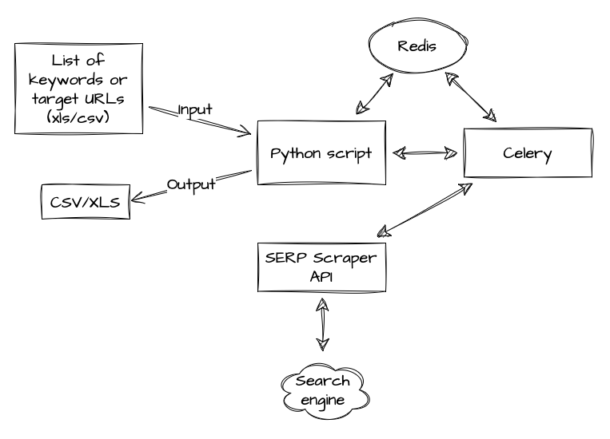

## Scraping Experts - Building SEO Monitoring System using Python, Celery, and a SERP Scraper API

[](https://oxylabs.io/pages/gitoxy?utm_source=877&utm_medium=affiliate&groupid=877&utm_content=seo-monitoring-github&transaction_id=102f49063ab94276ae8f116d224b67)

[](https://discord.gg/GbxmdGhZjq)

### Video 
[Building an SEO Monitoring System with Python, Celery, and SERP Scraper API](https://experts.oxylabs.io/lessons/building-seo-monitoring-system) (The API is now a part of Web Scraper API)

### Abstract



This solution is based on the data engineering principles of data ingestion and processing with a combination of remote calls for data enrichment.

**The features are as follows:**
- Accepts CSV or XLSX files as an input for keyword SERP scraping
- Moves input file to different directory after it was processed
- Cleans the input keywords and prepares them to be submitted to Oxylabs Web Scraper API
- Uses Celery to produce parallel requests to Web Scraper API (*refer [docker-compose](docker-compose.yml) for `--autoscale` parameter use*)
- Aggregates the responses in exact-same order as they were submitted to the Celery worker as a task
- Retry & timeout added for the Celery tasks
- Authenticates each request to Web Scraping API
- Produces a new output file (CSV or XLSX) with the results from Web Scraper API
- Continuously watches for a new input file to be added for processing

### Installation

This project uses Python 3.10.x version and runs on virtual environment (venv), therefore make sure that the Python installation on your local system exists.

#### Credentials and configuration

To properly configure the application, copy-rename bundled `dist.env` to `.env` and update the parameters as needed (*refer the docs at [Oxylabs SERP Scraper API docs](https://developers.oxylabs.io/scraper-apis/web-scraper-api)*):

SERP configuration
- SERP_TARGET=**xxxxxxx** *([Refer to the Oxylabs Web Scraper API docs](https://developers.oxylabs.io/scraper-apis/web-scraper-api))*
- SERP_DOMAIN=**xxxxxxx** *([Refer to the Oxylabs Web Scraper API docs](https://developers.oxylabs.io/scraper-apis/web-scraper-api))*
- SERP_PARSE_RESULT=**True** *(Should Web Scraper API parse the results?)*
- SERP_LANGUAGE=**en**
- SERP_PAGES=**5** *(how many pages to scrape)*

Local directories and file watcher poll (using seconds)
- INPUT_KEYWORDS=**"./input"** *(Where keyword input file will be put)*
- INPUT_PROCESSED=**"./input/processed"** *(Where processed keyword input file will be put)*
- OUTPUT_KEYWORDS=**"./output"** *(Where result output file will be put)*
- OUTPUT_FILE_TYPE=**xlsx** *(What OUTPUT file type to use [CSV/XLSX])*
- OUTPUT_FILE_NAME=**keywords_serps** *(What name to use for OUTPUT file)*
- INPUT_POLL_TIME=**5** *(How many seconds to wait before checking for new input files)*

Web Scraper API authentication
- OXY_SERPS_AUTH_USERNAME=**XXXXX**
- OXY_SERPS_AUTH_PASSWORD=**YYYYY**

#### Local (Mac)

1. Checkout the `scraping-experts-seo-monitoring` source 
2. Run: `cd scraping-experts-seo-monitoring`
3. Run: `python3.10 -m venv venv`
4. Run: `source venv/bin/activate`
5. Run: `pip install --upgrade pip wheel setuptools`
6. Run: `pip install -r requirements.txt`

Additionally, it is required to download internal python library artefacts to use the word tokenizer. To do this, after the project was installed, follow:
1. Run: `cd scraping-experts-seo-monitoring`
2. Run: `source venv/bin/activate`
3. Run: `python` (you will be prompted with Python CLI)
4. Run: `import nltk; nltk.download('punkt')`
5. Run: `import nltk; nltk.download('stopwords')`
6. Use `CTRL+D` to exit the Python CLI

Now you should be able to develop the project locally in your favourite IDE.

#### Docker (using Docker Compose)

1. Checkout the `scraping-experts-seo-monitoring` source 
2. Run: `cd scraping-experts-seo-monitoring`
3. Run: `docker-compose build`
4. Run: `docker-compose up -d --scale worker=5 && docker-compose logs -f`
5. To stop the services running, exit the log watch mode with `CTRL+C` and run `docker-compose down`

#### INPUT file

The input keywords file must be placed at the root of `/input` directory, where the Python application will scan for new files and as soon as it finds (`INPUT_POLL_TIME`) the file it starts to process. 

The application expects the XLSX file (or CSV) to have a following format:

XLSX

| Keyword |  
|---------|
| sample1 |
| sample2 |
| other   |

CSV (with header)

```csv
keyword
sample1
sample2
other
```
